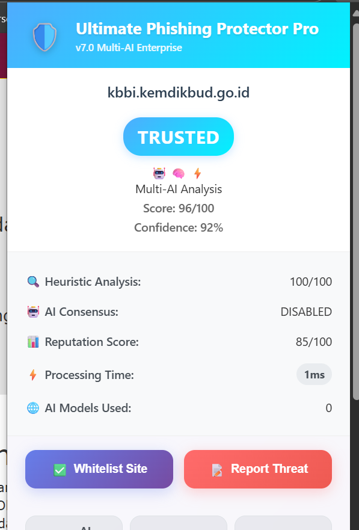
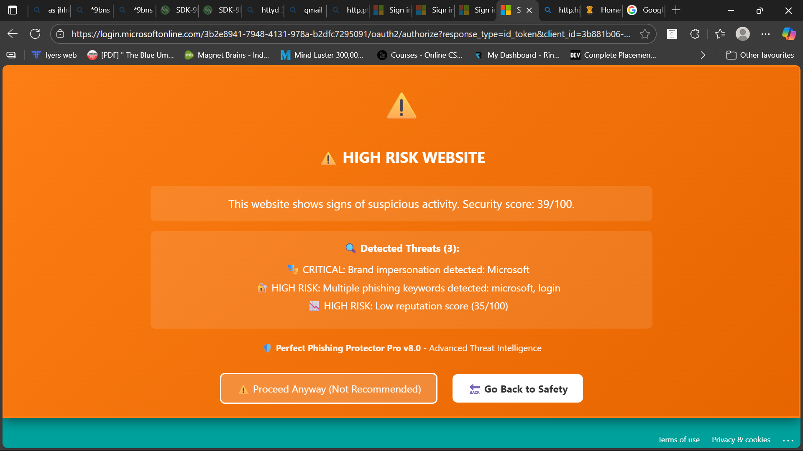
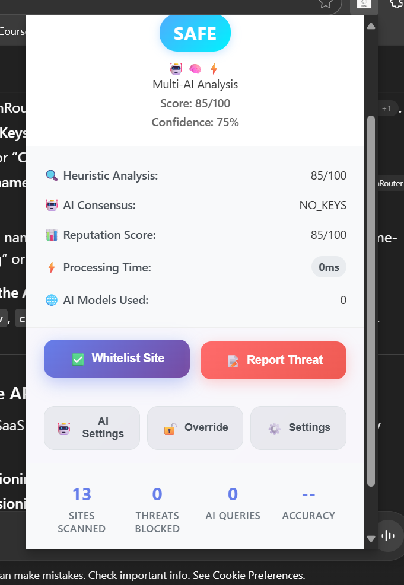

  

# 🛡️ FakeProtect – Stay Safe Online

---

🔒 **Stay safe online — FakeProtect detects and blocks fake websites in real-time using reputation scores, while still giving you the option to visit anyway.**

---

## ✨ Features
- 🚫 Detects & blocks **fake / phishing websites**  
- 🔔 Shows **reputation score** of every site  
- 🎨 Modern and **user-friendly UI**  
- 🔓 Allows **"Visit Anyway"** option  
- 🌍 Works on **Chrome & Edge** browsers  

---

## 📸 Screenshots

### 🔹 Extension Popup

### 🔹 Blocked Page

### 🔹 Settings Page

---

## ⚙️ How It Works
1. FakeProtect scans the website URL.  
2. Gets a **reputation score** from AI / APIs.  
3. Blocks the site if score < 30.  
4. User can either go back or **visit anyway**.  

---

👉 Do you want me to **write a polished CONTRIBUTING.md file just for FakeProtect** (with badges, emoji, and a contributor-friendly tone), so you can paste it directly?
